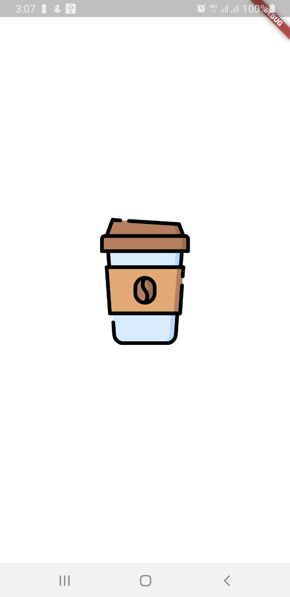
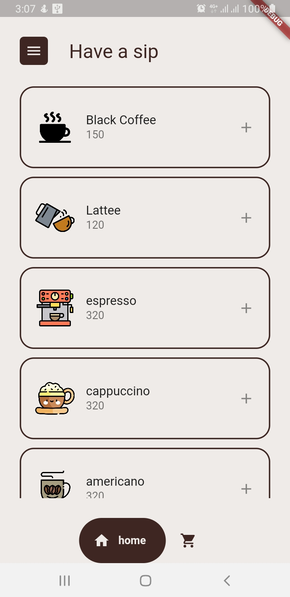
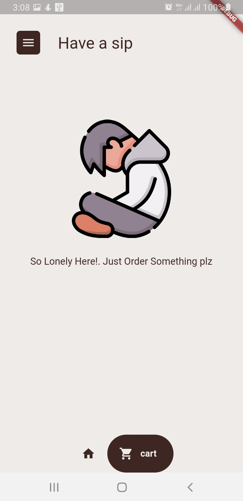
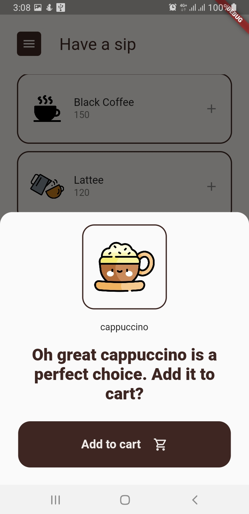
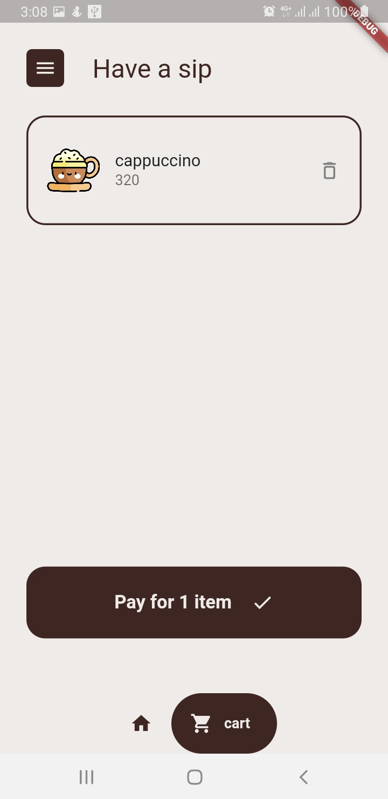
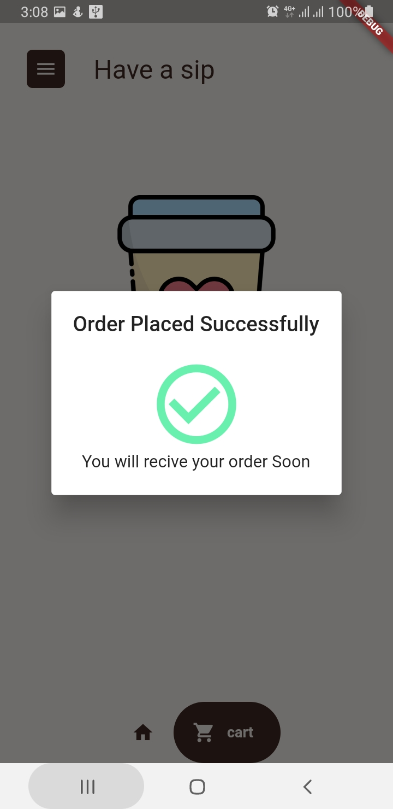
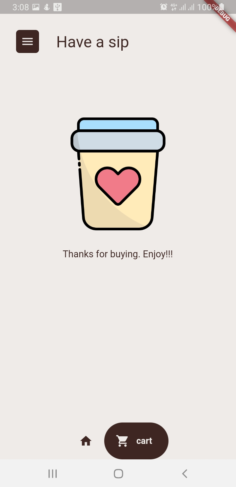

# coffety

A Flutter app for managing your coffee orders with a user-friendly interface . This app was created as a part of my learning journey with Flutter.

## Table of Contents
- [Introduction](#introduction)
- [Demo](#demo)
- [Features](#features)
- [Packages and Dependencies](#packages-and-dependencies)

## Screenshots

## Introduction

This app has a user friendly simple but good looking UI. With various vector images that enhances user experience. It has a splash screen and a shop and cart screen. The design is kept minimal and simple as it was created during my learning phase. During creation of this app i was trying to learn State Management using provider. And trying to practice more custom widgets and keep design consistency.

## Features

- Simple and Beautiful UI
- Coffee List
- Cart
- Vector Images
- State Management

## Packages and Dependencies

Below are the packages and dependencies used in this project:

- [cupertino_icons](https://pub.dev/packages/cupertino_icons) (Version: ^1.0.2): Flutter's own set of Cupertino icons for iOS-style design.

- [animated_splash_screen](https://pub.dev/packages/animated_splash_screen) (Version: ^1.3.0): Provides an animated splash screen for your app.

- [google_nav_bar](https://pub.dev/packages/google_nav_bar) (Version: ^5.0.6): A customizable bottom navigation bar with Google's Material Design look and feel.

- [provider](https://pub.dev/packages/provider): A package for state management in Flutter, which allows you to manage app-wide state and data.
